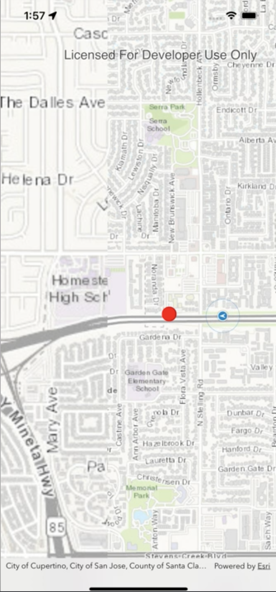

# ios-background-geotrigger

This code sample demonstrates monitoring Geotriggers in the background on iOS.

## Features
* Geotriggers - Monitor device location as it enters and exits areas of interest

## Instructions

1. Fork and then clone the repo.
2. Set your API Key* in the `AppDelegate.application(_:didFinishLaunchingWithOptions:)` method.
3. Ensure that you have set up for background location updates:
  * Ensure you have permission to access the user's current location while the app is in the background by adding this [Property List Key](https://developer.apple.com/documentation/bundleresources/information_property_list/nslocationalwaysandwheninuseusagedescription). Read [here](https://developer.apple.com/documentation/corelocation/choosing_the_location_services_authorization_to_request) about choosing the location services authorization to request.
  * Turn on "Location Updates" in Background Modes in your project. If you don't see Background Modes under Signing & Capabilites then you need to add that capability using the "+ Capability" button under Signing & Capabilites.
  * Ensure you have set the `CLLocationManager.allowsBackgroundLocationUpdates` property to true.
    * In the Cocoa API, the `CLLocationManager` is present under `AGSCLLocationDataSource.locationManager`
3. Run the app and accept permission requests.
4. Tap on the map to create a graphic which will be used for a fence with a 10 meter buffer.
5. Move the app to the background and observe that notifications are received when the device enters the fence's radius.

* API key: A permanent key that gives your application access to Esri location services. Visit your ArcGIS Developers Dashboard to create a new API key or access an existing API key.

## Requirements

* Xcode
* Network access

## Resources

* [Work with Geotriggers on iOS](https://developers.arcgis.com/ios/device-location/work-with-geotriggers/)
* [Work with Geotriggers on Android](https://developers.arcgis.com/android/device-location/work-with-geotriggers/)
* [Maintaining Clean Architecture on Android with Geotriggers using Dependency Injection]()

## Issues

Find a bug or want to request a new feature?  Please let us know by submitting an issue.

## Contributing

Esri welcomes contributions from anyone and everyone. Please see our [guidelines for contributing](https://github.com/esri/contributing).

## Licensing

Copyright 2021 Esri

Licensed under the Apache License, Version 2.0 (the "License");
you may not use this file except in compliance with the License.
You may obtain a copy of the License at

   http://www.apache.org/licenses/LICENSE-2.0

Unless required by applicable law or agreed to in writing, software
distributed under the License is distributed on an "AS IS" BASIS,
WITHOUT WARRANTIES OR CONDITIONS OF ANY KIND, either express or implied.
See the License for the specific language governing permissions and
limitations under the License.

A copy of the license is available in the repository's [license.txt](license.txt) file.​
